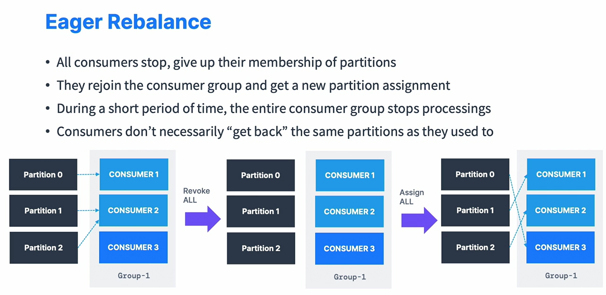
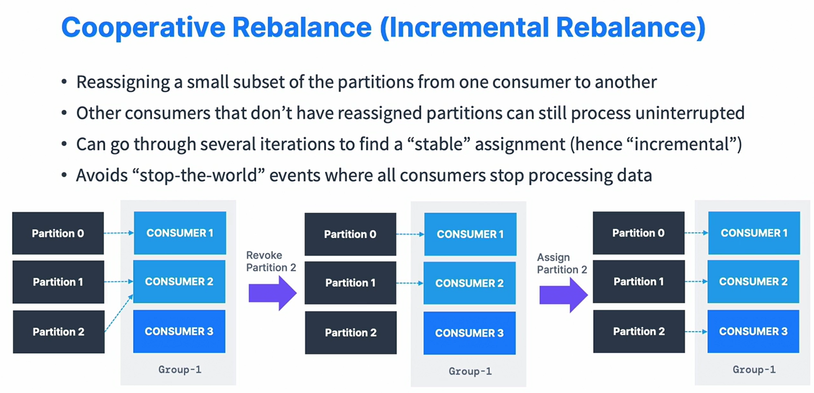

### Windows wsl2 Kafka konfiguration

```shell
nano ~/kafka_2.13-3.9.0/config/kraft/server.properties
advertised.listeners=PLAINTEXT://<WSL2_IP>:9092,CONTROLLER://localhost:9093
```

### offsets. from-begining vs from now
```java
props.setProperty("auto.offset.reset", "earliest"); //from-begining
props.setProperty("auto.offset.reset", "latest"); // from now
```
### async offset commit by interval
```java 
props.setProperty("auto.commit.interval.ms", "1000");
props.setProperty("session.timeout.ms", "30000");
```
### Gracefully shutdown
```java
// 1 register ShutdownHook and throw wakeup 
final Thread createThread = Thread.currentThread();
Runtime.getRuntime().addShutdownHook(new Thread() {
            public void run() {
                logger.info("Detected Shutdown, lets exit by calling consumer.wakeup()...");
                consumer.wakeup();
                try {
                    createThread.join();
                } catch (InterruptedException e) {
                    throw new RuntimeException(e);
                }
            }
});
        
 // 2. handle wakeup with consumer commits offsets and close actions as final

        try {
            consumer.subscribe(List.of(topic));
            while (true) {
                ConsumerRecords<String, String> records = consumer.poll(1000);
                for (ConsumerRecord<String, String> record : records) {
                    logger.info("Key: " + record.key() + ", Value: " + record.value() + ", Partition: " + record.partition() + ", Offset: " + record.offset());
                }
            }
        } catch (WakeupException e) {
            logger.info("Consumer is starting to shut down");
        } catch (Exception e) {
            logger.error("Unexpected error while consuming records", e);
        } finally {
            consumer.close(); // commit offsets
            logger.info("Consumer is gracefully shut down");
        }
```

### Producer callback to get info about message sent
```java
producer.send(record, new Callback() {
    @Override
    public void onCompletion(RecordMetadata recordMetadata, Exception e) {
        if (e != null) {
            logger.error("Error occurred while sending message", e);
        } else {
            logger.info("Message sent successfully \n"
                    + "key: " + key + "\n"
                    + "topic: " + recordMetadata.topic() + "\n"
                    + "partition: " + recordMetadata.partition() + "\n"
                    + "offset: " + recordMetadata.offset() + "\n"
                    + "timestamp: " + recordMetadata.timestamp()
            );
        }
    }
});
```

### Consumer rebalance. Eager vs Incremental(Cooperative)
```java
// eager. Default. assign partition on a per-topic basis (can lead to imbalance)
props.setProperty("partition.assigment.strategy", RangeAssignor.class.getName());
// eager. assign partition across all topiCs in round-robin fasion, !!!optimal balance
props.setProperty("partition.assigment.strategy", RoundRobinAssignor.class.getName());
// eager. like RoundRobin, with minimises partition movments when consumer join 
props.setProperty("partition.assigment.strategy", StickyAssignor.class.getName());
// incremental. rebalance strategy 
props.setProperty("partition.assigment.strategy", CooperativeStickyAssignor.class.getName());
```
1. Eager - default (stops all consuming for some period of time)

2. Incremental Rebalance 


#### Consumer rebalance. Static Group Membership
```java

props.setProperty("group.instance.id", SOME_STATIC_ID);
// the consumer with STATIC_ID has timeouts ms to rejopin to the same topic partition without rebalancing. it is good in case local state and cache 
props.setProperty("session.timeouts.ms", 20000);
```

## Optimization (high througput)

### Compression  
[compression](https://blog.cloudflare.com/squeezing-the-firehose/)
props.setProperty(ProducerConfig.COMPRESSION_TYPE_CONFIG, "snappy");
snappy is good for jsons

### threads
props.setProperty(ProducerConfig.MAX_IN_FLIGHT_REQUESTS_PER_CONNECTION, "5"); // default

### batching
props.setProperty(ProducerConfig.LINGER_MS_CONFIG, "20"); collect batch
props.setProperty(ProducerConfig.BATCH_SIZE_CONFIG, Integer.toString(32*1024)); in kb (default 16 ) bigger batch -> better compression


### buffer 
if producer producess faster than the broker
props.setProperty(ProducerConfig.BUFFER_MEMORY_CONFIG, ); //32 MB by default