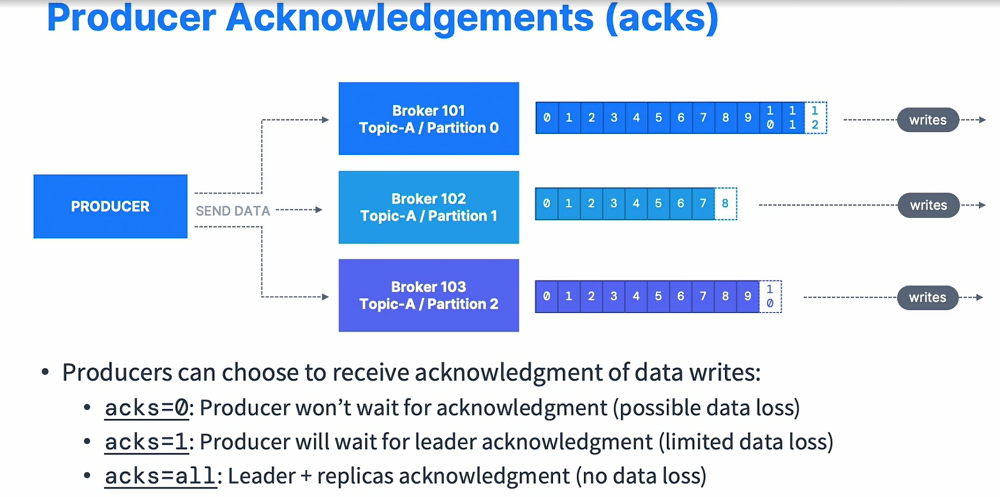

## kafka topic creation 
```shell
kafka-topics.sh --bootstrap-server localhost:9092 --topic wikimedia_changes --create --partitions 3 --replication-factor 1
```

### producer_acknowlegements


```java
props.setProperty("acks", "all");
props.setProperty("min.insync.replicas", "1");
```
min.insync.replicas=1 only the broker leader needs to successfully ack

### retries with enable.idempotence = false
```java
props.setProperty("retries", "3");
props.setProperty("retry.backoff.ms", "10");
props.setProperty("delivery.timeout.ms", "500");
```

! retries are autoset in case of enable.idempotence = true (kafka > 3 is default) -> SAFFFE
! max.in.flight.requests.per.connection = 5 max performance 

## Optimization (high througput)

### Compression
[compression](https://blog.cloudflare.com/squeezing-the-firehose/)
props.setProperty(ProducerConfig.COMPRESSION_TYPE_CONFIG, "snappy");
snappy is good for jsons

### threads
props.setProperty(ProducerConfig.MAX_IN_FLIGHT_REQUESTS_PER_CONNECTION, "5"); // default

### batching
props.setProperty(ProducerConfig.LINGER_MS_CONFIG, "20"); collect batch
props.setProperty(ProducerConfig.BATCH_SIZE_CONFIG, Integer.toString(32*1024)); in kb (default 16 ) bigger batch -> better compression


### buffer
//if producer producess faster than the broker
props.setProperty(ProducerConfig.BUFFER_MEMORY_CONFIG, );
// if buffer is full, then .send will start to block. and block.ms is time to throw exception
props.setProperty(ProducerConfig.MAX_BLOCK_MS_CONFIG, Long.toString(5000) );