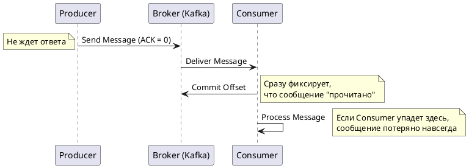
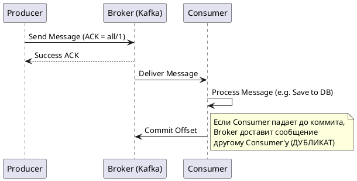
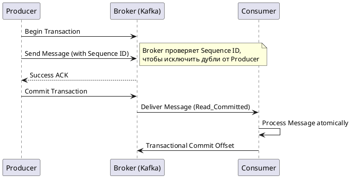

Семантики доставки сообщений описывают гарантии того, как распределенная система (например, брокер сообщений Apache Kafka или RabbitMQ) будет обрабатывать отправку и получение данных в условиях возможных сетевых сбоев, падений узлов и таймаутов.

Ниже представлен подробный разбор трех классических семантик, а также ответы на все ваши вопросы.

---

### 1. Существуют ли другие семантики?

Классическая теория распределенных систем выделяет только три базовые семантики: **At most once**, **At least once** и **Exactly once**.

Однако на практике (и в архитектурных паттернах) часто выделяют четвертую:

- **Effectively once (Эффективно один раз):** Это не встроенная семантика брокера, а архитектурный подход. Система работает в режиме _At least once_ (допуская дубликаты из брокера), но на стороне консюмера (получателя) реализована **идемпотентность**. Это означает, что получатель запоминает идентификаторы обработанных сообщений (например, в базе данных) и при получении дубликата просто игнорирует его. Для бизнес-логики результат выглядит так, будто сообщение было доставлено ровно один раз.
    

---

### 2, 3 и 4. Разбор семантик (Примеры, Диаграммы, Плюсы и Минусы)

#### 🔸 At most once (Максимум один раз / "Fire and forget")

Продюсер отправляет сообщение и не ждет подтверждения (ACK) от брокера. Консюмер читает сообщение, сразу же сохраняет свой сдвиг (commit offset), и только потом начинает обработку. Если кто-то падает, сообщение теряется навсегда.

- **Пример:** Сбор метрик (CPU, RAM серверов) или телеметрии IoT-устройств. Если из 10 000 метрик в секунду потеряется 5, график мониторинга не пострадает.
    
- **Плюсы (Pros):** Максимальная пропускная способность, минимальная задержка (latency), нет дубликатов сообщений.
    
- **Минусы (Cons):** Высокий риск потери данных при сетевых сбоях или падении приложения.
    

**Sequence Diagram (PlantUML):**

Code snippet



#### 🔸 At least once (Как минимум один раз)

Продюсер ждет подтверждения от брокера о сохранении сообщения; если ответа нет — отправляет заново. Консюмер сначала обрабатывает сообщение (например, сохраняет данные в БД), и только после успешной обработки делает _commit offset_.

- **Пример:** Отправка email-уведомлений или обработка заказов в интернет-магазине. Лучше отправить клиенту два письма об успешном заказе, чем потерять заказ.
    
- **Плюсы (Pros):** Гарантия того, что данные не потеряются (нулевая потеря данных).
    
- **Минусы (Cons):** Могут возникать дубликаты (например, если консюмер обработал данные, но упал за миллисекунду до отправки _commit offset_ — при перезапуске он прочитает это же сообщение снова).
    

**Sequence Diagram (PlantUML):**

Code snippet



#### 🔸 Exactly once (Ровно один раз)

Самая сложная семантика. Гарантирует, что сообщение будет обработано ровно один раз. В Kafka это достигается связкой "Идемпотентный Продюсер + Транзакционный API". Продюсер помечает сообщения уникальным Sequence ID, чтобы брокер отсеивал дубликаты при ретраях, а консюмер читает только "закомиченные" транзакции.

- **Пример:** Финансовые транзакции (перевод денег между счетами), биллинг, списание баланса.
    
- **Плюсы (Pros):** Идеальная консистентность данных. Нет ни потерь, ни дубликатов на уровне системы.
    
- **Минусы (Cons):** Сильное падение производительности (пропускная способность падает из-за накладных расходов на транзакции), задержки растут, сложная настройка.
    

**Sequence Diagram (PlantUML):**

Code snippet



---

### 5. Best Practices (Лучшие практики)

1. **По умолчанию выбирайте "At least once" + "Идемпотентный консюмер" (Effectively once).**
    
    В 95% бизнес-задач пытаться настроить строгий _Exactly once_ на уровне брокера не стоит (это дорого и медленно). Гораздо проще и надежнее настроить _At least once_ и добавить в базу данных консюмера таблицу `processed_messages_ids`. При получении сообщения консюмер проверяет: "Видел ли я этот ID?". Если да — пропускает (ACK брокеру), если нет — обрабатывает.
    
2. **Всегда включайте идемпотентность продюсера.**
    
    Начиная с Kafka 3.0, параметр `enable.idempotence=true` включен по умолчанию. Это позволяет продюсеру безболезненно повторять отправку сообщений при сетевых сбоях — Kafka сама отбросит дубликаты по Sequence ID. Это "бесплатный" бонус к надежности.
    
3. **Используйте "Exactly once" только там, где без него не обойтись.**
    
    Включайте транзакционное API (`isolation.level=read_committed`, `transactional.id`) только для критичных пайплайнов (например, стриминговая аналитика Kafka Streams типа "считаем баланс" или перекладка денег).
    
4. **Обрабатывайте "Ядовитые сообщения" (Poison Pills).**
    
    При _At least once_ консюмер может вечно пытаться обработать сообщение, падая с ошибкой формата (например, битый JSON), блокируя всю очередь. Обязательно настраивайте Dead Letter Queue (DLQ / DLT), как описано в статье, которую вы читаете: после 3-5 неудачных попыток сообщение должно улетать в резервный топик для ручного разбора, а консюмер должен идти дальше.


Реализация семантик в Kafka на Java (с использованием нативной библиотеки `kafka-clients`) сводится к двум вещам: **настройке конфигураций (Properties)** и **выбору правильного момента для фиксации сдвига (commit)** у консюмера.

Ниже приведены минимальные, но рабочие примеры для каждой семантики.

---

### 1. At most once (Максимум один раз)

- **Продюсер** отправляет данные и не ждет ответа (`acks=0`).
    
- **Консюмер** читает данные и _сразу же_ фиксирует их прочтение (commit), еще до начала бизнес-логики.
    

**Producer (At most once):**

Java

```
Properties props = new Properties();
props.put(ProducerConfig.BOOTSTRAP_SERVERS_CONFIG, "localhost:9092");
props.put(ProducerConfig.KEY_SERIALIZER_CLASS_CONFIG, StringSerializer.class);
props.put(ProducerConfig.VALUE_SERIALIZER_CLASS_CONFIG, StringSerializer.class);
// САМОЕ ВАЖНОЕ: Не ждем подтверждения от брокера
props.put(ProducerConfig.ACKS_CONFIG, "0"); 

KafkaProducer<String, String> producer = new KafkaProducer<>(props);
// Отправили и забыли (не вызываем .get() у Future)
producer.send(new ProducerRecord<>("my-topic", "key", "message"));
```

**Consumer (At most once):**

Java

```
Properties props = new Properties();
props.put(ConsumerConfig.BOOTSTRAP_SERVERS_CONFIG, "localhost:9092");
props.put(ConsumerConfig.GROUP_ID_CONFIG, "group-1");
// САМОЕ ВАЖНОЕ: Отключаем автокоммит, чтобы контролировать его вручную
props.put(ConsumerConfig.ENABLE_AUTO_COMMIT_CONFIG, "false");

KafkaConsumer<String, String> consumer = new KafkaConsumer<>(props);
consumer.subscribe(Collections.singletonList("my-topic"));

while (true) {
    ConsumerRecords<String, String> records = consumer.poll(Duration.ofMillis(100));
    if (!records.isEmpty()) {
        // 1. СРАЗУ делаем коммит (если упадем после этого, сообщения потеряются)
        consumer.commitSync();
        
        // 2. Только потом обрабатываем
        for (ConsumerRecord<String, String> record : records) {
            System.out.println("Processing: " + record.value());
            // Если тут выбросится Exception, сообщение уже помечено как прочитанное
        }
    }
}
```

---

### 2. At least once (Как минимум один раз)

- **Продюсер** требует подтверждения от всех реплик (`acks=all`) и повторяет отправку при ошибке.
    
- **Консюмер** сначала обрабатывает данные, и _только потом_ фиксирует прочтение.
    

**Producer (At least once):**

Java

```
Properties props = new Properties();
// ... (настройки серверов и сериализаторов) ...
// САМОЕ ВАЖНОЕ: Ждем ответа от всех in-sync реплик брокера
props.put(ProducerConfig.ACKS_CONFIG, "all");
props.put(ProducerConfig.RETRIES_CONFIG, Integer.MAX_VALUE); // Бесконечные ретраи

KafkaProducer<String, String> producer = new KafkaProducer<>(props);
try {
    // Вызов .get() блокирует поток до получения ACK от брокера
    producer.send(new ProducerRecord<>("my-topic", "key", "message")).get();
} catch (Exception e) {
    e.printStackTrace(); // Обработка ошибки доставки
}
```

**Consumer (At least once):**

Java

```
Properties props = new Properties();
// ... (настройки серверов) ...
props.put(ConsumerConfig.ENABLE_AUTO_COMMIT_CONFIG, "false"); // Ручной коммит

KafkaConsumer<String, String> consumer = new KafkaConsumer<>(props);
consumer.subscribe(Collections.singletonList("my-topic"));

while (true) {
    ConsumerRecords<String, String> records = consumer.poll(Duration.ofMillis(100));
    
    // 1. Сначала полностью обрабатываем сообщения
    for (ConsumerRecord<String, String> record : records) {
        saveToDatabase(record.value()); // Ваша бизнес-логика
    }
    
    // 2. ТОЛЬКО ПОТОМ делаем коммит. 
    // Если упали на шаге 1, при рестарте прочитаем эти же сообщения снова (будет дубликат).
    if (!records.isEmpty()) {
        consumer.commitSync();
    }
}
```

---

### 3. Exactly once (Ровно один раз — транзакционный API)

Используется, когда продюсер публикует данные сразу в несколько топиков/партиций, либо когда идет цикл "Consume -> Transform -> Produce" (читаем из Kafka, меняем, пишем обратно в Kafka).

**Producer (Exactly once):**

Java

```
Properties props = new Properties();
props.put(ProducerConfig.ACKS_CONFIG, "all");
// 1. Включаем идемпотентность (защита от дублей при ретраях самого продюсера)
props.put(ProducerConfig.ENABLE_IDEMPOTENCE_CONFIG, "true");
// 2. Задаем уникальный ID транзакции
props.put(ProducerConfig.TRANSACTIONAL_ID_CONFIG, "my-transactional-id");

KafkaProducer<String, String> producer = new KafkaProducer<>(props);

// Инициализируем транзакции (один раз при старте)
producer.initTransactions();

try {
    producer.beginTransaction(); // Начинаем транзакцию
    
    producer.send(new ProducerRecord<>("topic-A", "key", "msg1"));
    producer.send(new ProducerRecord<>("topic-B", "key", "msg2"));
    
    producer.commitTransaction(); // Коммитим. Брокер сделает сообщения видимыми для консюмеров
} catch (ProducerFencedException | OutOfOrderSequenceException | AuthorizationException e) {
    producer.close(); // Фатальные ошибки, нужно убить продюсера
} catch (KafkaException e) {
    producer.abortTransaction(); // Что-то пошло не так, откатываем транзакцию
}
```

**Consumer (Exactly once):**

Java

```
Properties props = new Properties();
// ... (настройки серверов) ...
props.put(ConsumerConfig.ENABLE_AUTO_COMMIT_CONFIG, "false");
// САМОЕ ВАЖНОЕ: Читаем только те сообщения, транзакции которых были успешно закоммичены
props.put(ConsumerConfig.ISOLATION_LEVEL_CONFIG, "read_committed");

KafkaConsumer<String, String> consumer = new KafkaConsumer<>(props);
// Дальше логика чтения такая же, как в At least once. 
// Разница в том, что брокер просто не отдаст вам "грязные" (откаченные) сообщения.
```

---

### 4. Effectively once (Эффективно один раз — Идемпотентный консюмер)

_Это самый популярный и надежный паттерн в Enterprise (и в Spring)._

Брокер работает в режиме **At least once**, но консюмер защищен от дубликатов с помощью проверки уникального ID сообщения (например, в базе данных).

**Producer:**

Любой надежный продюсер с `acks=all` и `enable.idempotence=true` (в Kafka 3.0+ идемпотентность включена по умолчанию). Важно, чтобы в сообщении (или в заголовках Kafka) был уникальный бизнес-ключ (например, `order_id`).

**Consumer (Effectively once):**

Java

```
// Настройки Kafka как в "At least once" (отключен auto_commit).

while (true) {
    ConsumerRecords<String, String> records = consumer.poll(Duration.ofMillis(100));
    
    for (ConsumerRecord<String, String> record : records) {
        String messageId = getMessageId(record); // Достаем уникальный ID (из ключа или тела JSON)
        
        // --- БИЗНЕС ЛОГИКА ---
        // Делаем это внутри транзакции БД (Spring @Transactional)
        try {
            boolean isAlreadyProcessed = database.checkIfProcessed(messageId);
            
            if (!isAlreadyProcessed) {
                processMessage(record.value());
                database.saveProcessedId(messageId); // Сохраняем ID, чтобы не обработать повторно
            } else {
                System.out.println("Дубликат обнаружен и проигнорирован: " + messageId);
            }
        } catch (Exception e) {
             // Логируем, отправляем в DLT (Dead Letter Topic), но не делаем commit для этого offset'a 
             // или делаем, если хотим пропустить битое сообщение.
        }
    }
    
    if (!records.isEmpty()) {
        consumer.commitSync(); // Сообщаем брокеру, что батч обработан
    }
}
```

> **Совет по Spring Kafka (как на вашем скриншоте):**
> 
> Если вы используете Spring (`@KafkaListener`), вам не нужно писать циклы `poll` руками.
> 
> Для **At least once** установите в `application.yml` свойство `spring.kafka.listener.ack-mode=MANUAL_IMMEDIATE` и вызывайте `acknowledgment.acknowledge()` в конце метода.
> 
> Для **Effectively once** просто проверяйте уникальность ID в начале метода с аннотацией `@KafkaListener` и `@Transactional`.