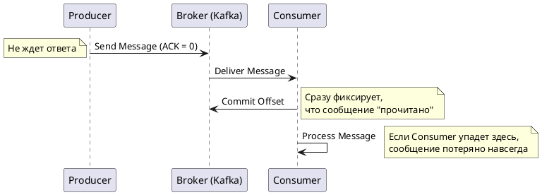
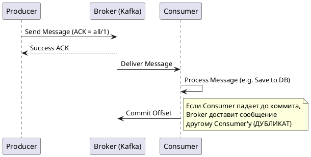
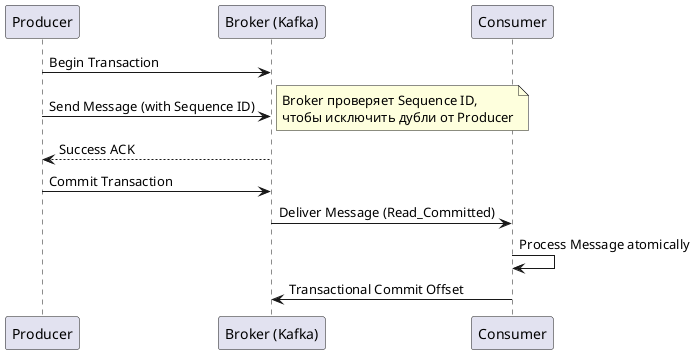

Семантики доставки сообщений описывают гарантии того, как распределенная система (например, брокер сообщений Apache Kafka или RabbitMQ) будет обрабатывать отправку и получение данных в условиях возможных сетевых сбоев, падений узлов и таймаутов.

Ниже представлен подробный разбор трех классических семантик, а также ответы на все ваши вопросы.

---

### 1. Существуют ли другие семантики?

Классическая теория распределенных систем выделяет только три базовые семантики: **At most once**, **At least once** и **Exactly once**.

Однако на практике (и в архитектурных паттернах) часто выделяют четвертую:

- **Effectively once (Эффективно один раз):** Это не встроенная семантика брокера, а архитектурный подход. Система работает в режиме _At least once_ (допуская дубликаты из брокера), но на стороне консюмера (получателя) реализована **идемпотентность**. Это означает, что получатель запоминает идентификаторы обработанных сообщений (например, в базе данных) и при получении дубликата просто игнорирует его. Для бизнес-логики результат выглядит так, будто сообщение было доставлено ровно один раз.
    

---

### 2, 3 и 4. Разбор семантик (Примеры, Диаграммы, Плюсы и Минусы)

#### 🔸 At most once (Максимум один раз / "Fire and forget")

Продюсер отправляет сообщение и не ждет подтверждения (ACK) от брокера. Консюмер читает сообщение, сразу же сохраняет свой сдвиг (commit offset), и только потом начинает обработку. Если кто-то падает, сообщение теряется навсегда.

- **Пример:** Сбор метрик (CPU, RAM серверов) или телеметрии IoT-устройств. Если из 10 000 метрик в секунду потеряется 5, график мониторинга не пострадает.
    
- **Плюсы (Pros):** Максимальная пропускная способность, минимальная задержка (latency), нет дубликатов сообщений.
    
- **Минусы (Cons):** Высокий риск потери данных при сетевых сбоях или падении приложения.
    

**Sequence Diagram (PlantUML):**

Code snippet

#### 🔸 At least once (Как минимум один раз)

Продюсер ждет подтверждения от брокера о сохранении сообщения; если ответа нет — отправляет заново. Консюмер сначала обрабатывает сообщение (например, сохраняет данные в БД), и только после успешной обработки делает _commit offset_.

- **Пример:** Отправка email-уведомлений или обработка заказов в интернет-магазине. Лучше отправить клиенту два письма об успешном заказе, чем потерять заказ.
    
- **Плюсы (Pros):** Гарантия того, что данные не потеряются (нулевая потеря данных).
    
- **Минусы (Cons):** Могут возникать дубликаты (например, если консюмер обработал данные, но упал за миллисекунду до отправки _commit offset_ — при перезапуске он прочитает это же сообщение снова).
    

**Sequence Diagram (PlantUML):**

Code snippet

#### 🔸 Exactly once (Ровно один раз)

Самая сложная семантика. Гарантирует, что сообщение будет обработано ровно один раз. В Kafka это достигается связкой "Идемпотентный Продюсер + Транзакционный API". Продюсер помечает сообщения уникальным Sequence ID, чтобы брокер отсеивал дубликаты при ретраях, а консюмер читает только "закомиченные" транзакции.

- **Пример:** Финансовые транзакции (перевод денег между счетами), биллинг, списание баланса.
    
- **Плюсы (Pros):** Идеальная консистентность данных. Нет ни потерь, ни дубликатов на уровне системы.
    
- **Минусы (Cons):** Сильное падение производительности (пропускная способность падает из-за накладных расходов на транзакции), задержки растут, сложная настройка.
    

**Sequence Diagram (PlantUML):**

Code snippet

---

### 5. Best Practices (Лучшие практики)

1. **По умолчанию выбирайте "At least once" + "Идемпотентный консюмер" (Effectively once).**
    
    В 95% бизнес-задач пытаться настроить строгий _Exactly once_ на уровне брокера не стоит (это дорого и медленно). Гораздо проще и надежнее настроить _At least once_ и добавить в базу данных консюмера таблицу `processed_messages_ids`. При получении сообщения консюмер проверяет: "Видел ли я этот ID?". Если да — пропускает (ACK брокеру), если нет — обрабатывает.
    
2. **Всегда включайте идемпотентность продюсера.**
    
    Начиная с Kafka 3.0, параметр `enable.idempotence=true` включен по умолчанию. Это позволяет продюсеру безболезненно повторять отправку сообщений при сетевых сбоях — Kafka сама отбросит дубликаты по Sequence ID. Это "бесплатный" бонус к надежности.
    
3. **Используйте "Exactly once" только там, где без него не обойтись.**
    
    Включайте транзакционное API (`isolation.level=read_committed`, `transactional.id`) только для критичных пайплайнов (например, стриминговая аналитика Kafka Streams типа "считаем баланс" или перекладка денег).
    
4. **Обрабатывайте "Ядовитые сообщения" (Poison Pills).**
    
    При _At least once_ консюмер может вечно пытаться обработать сообщение, падая с ошибкой формата (например, битый JSON), блокируя всю очередь. Обязательно настраивайте Dead Letter Queue (DLQ / DLT), как описано в статье, которую вы читаете: после 3-5 неудачных попыток сообщение должно улетать в резервный топик для ручного разбора, а консюмер должен идти дальше.