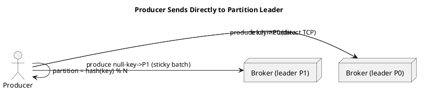

# Producers

**Producers (продюсеры / отправители)** are clients that write events to Kafka [Topics](Topics.md).
- They control how events are assigned to [Partitions](Partitions.md) (e.g., round-robin or via an event key).
- They send data **directly to the partition leader (лидер)** broker — no intervening routing tier ("smart client" design), using cluster **metadata (метаданные)** to route requests.

## Partition Assignment
- **With Key:** The producer computes a hash on the key and applies a modulo operation based on the total partition count. This guarantees that messages with the same key go to the same partition, preserving order.
- **Without Key (Null):** The producer uses a "sticky partition" strategy, where messages are grouped into batches (by size or time) and sent to a partition, balancing load while maintaining low latency.

## Acknowledgments (Acks)
Producers can configure how strictly they require acknowledgment from brokers to ensure message delivery:
- **`acks=0` (None):** The producer doesn't wait for any acknowledgment. Lowest latency, highest risk of data loss.
- **`acks=1` (Leader):** The producer waits for the leader replica of the partition to acknowledge the message.
- **`acks=-1` or `all`:** The producer waits for both the leader and all in-sync follower replicas to acknowledge. Slowest, but provides the strongest guarantee against data loss.

## Batching
Producers accumulate messages in memory and send larger requests for efficiency. See [Batching](Batching.md).
- Controlled by `batch.size` (bytes) and `linger.ms` (wait time).
- Trades a little latency for much higher throughput.

### Best Practices
- Use a meaningful key (e.g. `user_id`) when per-key ordering matters; otherwise rely on the sticky partitioner.
- Talk to brokers over the native protocol with direct network access; avoid a generic round-robin load balancer in front of brokers.
- Keep `enable.idempotence=true` (default) to prevent duplicates on retries.

### Case Studies
- **Anti-pattern — generic LB before brokers:** round-robin balancing breaks the smart-client model → `NotLeaderForPartitionException`, retries, timeouts, lost zero-copy efficiency.
- **Valid exceptions:** bootstrap-only LB, Kubernetes **TLS SNI** proxy (Envoy/HAProxy), or **Kafka REST Proxy** behind an HTTP LB for legacy/firewalled clients.

### Production-Ready Recommendations
- Set `advertised.listeners` so clients get reachable broker addresses.
- For critical data, combine `acks=all` + idempotence + (optionally) transactions — see [Delivery Semantics](Delivery_Semantics.md).
- For throughput, tune `linger.ms=5–20` and larger `batch.size`, scaling `buffer.memory` accordingly.

### Diagrams

*References:*
- [Introduction to Apache Kafka](../summaries/001_introduction.md)
- [What are Kafka Producers and How do they work?](../summaries/003_kafka_producers.md)
- [Kafka Producer Design](../summaries/008_kafka_producer_design.md)
