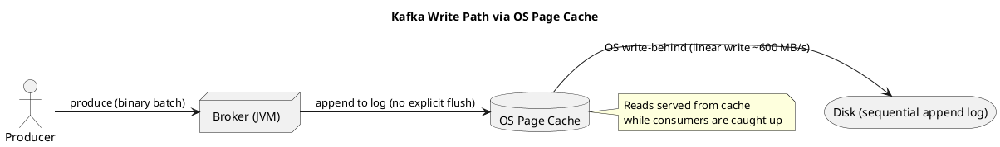

# Summary: Apache Kafka and the File System

**Source:** `raw/006. Apache Kafka and the File System.md`
**Source URL:** https://docs.confluent.io/kafka/design/file-system-constant-time.html
**Date Ingested:** 2026-07-09

## Key Takeaways
- Kafka deliberately relies on the **file system (файловая система)** and the OS **page cache (кэш страниц)** rather than an in-JVM cache.
- **Sequential vs. random I/O:** linear writes reach ~600 MB/s while random writes are ~6000x slower; the OS heavily optimizes linear access with read-ahead and write-behind.
- **JVM memory problems:** Java object overhead often doubles data size, and garbage collection (сборка мусора) slows as the heap grows — so an in-heap cache is a poor fit.
- **Page cache wins:** a 32 GB machine can dedicate 28–30 GB to cache with no GC penalty, and the cache stays warm across service restarts.
- **Constant-time persistent queue (O(1)):** Kafka appends to a log instead of using BTrees (O(log N)), decoupling performance from data size and allowing cheap high-capacity SATA disks.
- Because disk is effectively unlimited, Kafka can **retain (удерживать) messages** for long periods (e.g. a week) instead of deleting on consumption.

### Best Practices
- Give Kafka brokers plenty of free OS memory for the page cache; avoid oversized JVM heaps.
- Prefer many cheap, large sequential-friendly disks (JBOD) over expensive low-latency random-access storage.
- Keep the OS flush/dirty-page settings default and let the kernel manage cache coherency.

### Production-Ready Recommendations
- Size RAM so that the working set of recent data fits in page cache to keep consumers reading from memory.
- Do not run other memory-hungry processes on broker hosts that would evict Kafka's page cache.
- Use retention (`retention.ms` / `retention.bytes`) intentionally — long retention is cheap on disk but affects storage planning.

### Diagrams

## Concepts Covered
- [File System & Page Cache](../concepts/File_System_and_Page_Cache.md)
- [Topics](../concepts/Topics.md)
- [Brokers](../concepts/Brokers.md)

