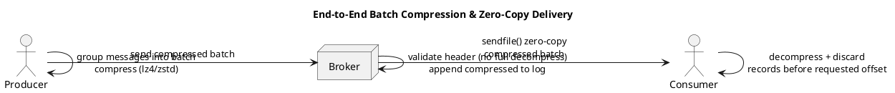

# Summary: Kafka Batch Processing for Efficiency

**Source:** `raw/007. Kafka Batch Processing for Efficiency.md`
**Source URL:** https://docs.confluent.io/kafka/design/efficient-design.html
**Date Ingested:** 2026-07-09

## Key Takeaways
- Efficiency underpins **multi-tenant (многоарендная)** operation; the two common inefficiencies are **excessive byte copying** and **too many small I/O operations**.
- **Standardized binary format** shared by producer, broker, and consumer lets data flow unchanged.
- **Zero-copy (нулевое копирование):** using the `sendfile` system call, data is copied into the page cache once and streamed to the network, approaching the network link limit; caught-up consumers cause no disk reads.
- **Batching / message sets (наборы сообщений):** grouping messages amortizes network round-trips and turns bursty random writes into large linear writes — improving speed by orders of magnitude.
- **End-to-end batch compression (сквозное сжатие):** batches are compressed by the producer, stored compressed on the broker, transmitted compressed, and decompressed only by the consumer. Supported codecs: **GZIP, Snappy, LZ4, ZStandard**.
- Brokers use a **sparse index (разреженный индекс)** pointing to a batch's Base Offset; they never decompress to serve a mid-batch offset — the consumer decompresses and discards records before the requested offset.

### Best Practices
- Producer batching is controlled by `batch.size` (bytes, default 16 KB) and `linger.ms` (default 0); a batch ships when either threshold is met.
- Enable compression (`compression.type=lz4` or `zstd`) **only together with batching** — with `linger.ms=0` compression wastes CPU.
- Keep `max.request.size` (producer) and `message.max.bytes` (broker) consistent to avoid `RecordTooLargeException`.

### Case Studies
- **High-throughput logs/metrics:** raising `linger.ms` to 5–20 ms and `batch.size` to 64 KB–1 MB dramatically reduces broker CPU load by replacing single-message spam with dense batches.

### Production-Ready Recommendations
- For throughput: `linger.ms=5–20`, `batch.size=65536`+, and scale `buffer.memory` (default 32 MB) up (64–128 MB) when using large batches or many partitions.
- Rely on **producer idempotence** (`enable.idempotence=true`, default on) to keep ordering and dedup on retries; keep `max.in.flight.requests.per.connection` ≤ 5.
- Tune `delivery.timeout.ms` (default 120 s) down for low-latency, time-sensitive data.

### Diagrams

## Concepts Covered
- [Batching](../concepts/Batching.md)
- [File System & Page Cache](../concepts/File_System_and_Page_Cache.md)
- [Producers](../concepts/Producers.md)

