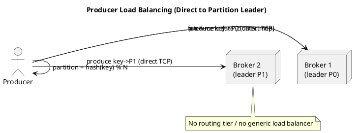

# Summary: Kafka Producer Design

**Source:** `raw/008. Kafka Producer Design.md`
**Source URL:** https://docs.confluent.io/kafka/design/producer-design.html
**Date Ingested:** 2026-07-09

## Key Takeaways
- A **producer (продюсер / отправитель)** is a client that publishes data directly to the partition **leader (лидер)** broker — there is no intervening routing tier.
- Brokers expose **metadata (метаданные)** (live brokers, partition leaders) so the producer routes requests itself ("smart client" design).
- **Load balancing (балансировка нагрузки)** can be random/round-robin or **semantic partitioning** by key (`hash(key) % partitions`), which gives **data locality (локальность данных)** — all events for a key land in one partition.
- **Batching (батчинг)** accumulates data in memory and sends larger requests, configured via `batch.size` and `linger.ms`, trading a little latency for much higher throughput.

### Best Practices
- Use a meaningful key (e.g. `user_id`) when per-key ordering matters; otherwise let the sticky partitioner balance load.
- Let the client talk to brokers over the native protocol with direct network access — do not put a generic round-robin load balancer between producers and brokers.

### Case Studies
- **Anti-pattern — generic LB in front of brokers:** a round-robin balancer (NGINX/HAProxy/ALB) breaks the smart-client model, causing `NotLeaderForPartitionException`, retries, timeouts, and loss of zero-copy efficiency.
- **Valid exceptions:** (1) LB only for `bootstrap.servers` discovery, then clients connect directly via `advertised.listeners`; (2) Kubernetes with **TLS SNI** proxy (Envoy/HAProxy) routing per-broker; (3) **Kafka REST Proxy** behind an HTTP LB for firewall-restricted or legacy clients.

### Production-Ready Recommendations
- Configure `advertised.listeners` correctly so clients receive reachable broker addresses.
- For external/Kubernetes access, prefer SNI routing or REST Proxy over generic TCP balancing to preserve direct client-to-leader connections.
- Combine batching with idempotence and `acks=all` for durable, high-throughput producers.

### Diagrams

## Concepts Covered
- [Producers](../concepts/Producers.md)
- [Partitions](../concepts/Partitions.md)
- [Batching](../concepts/Batching.md)

