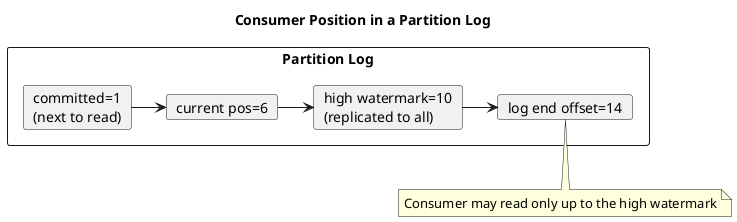

# Summary: Kafka Consumer Design — Consumers, Consumer Groups, and Offsets

**Source:** `raw/009. Kafka Consumer Design Consumers, Consumer Groups, and Offsets.md`
**Source URL:** https://docs.confluent.io/kafka/design/consumer-design.html
**Date Ingested:** 2026-07-09

## Key Takeaways
- A **consumer (консьюмер / получатель)** issues fetch requests to leader brokers, specifying a **log offset (офсет)**, giving it full control over what it reads and the ability to reconsume.
- **Push vs. pull (проталкивание против запроса):** producers push, consumers pull. Pull provides flow control (a slow consumer can catch up) and optimal batching without added latency.
- **Consumer group (группа потребителей):** consumers sharing a `group.id`; each partition is consumed by exactly one member of a group at a time. A broker-side **Group coordinator (координатор группы)** balances assignments using the internal `__consumer_offsets` topic.
- **Rebalance protocols (протоколы ребалансировки):** the "classic" (client-side leader assignment, eager/cooperative, high disruption) and the new "consumer" protocol (server-side, incremental, low disruption, GA in Kafka 4.0, `group.protocol=consumer`).
- **Offsets (офсеты):** an integer bookmark for the next record; periodically checkpointed to `__consumer_offsets` so consumers resume after failures/restarts.
- **Position markers:** current position, last committed offset, **high watermark (высокая отметка)** = last offset replicated to all replicas (consumers can only read up to it), and **log end offset**.

### Best Practices
- Match consumer count to partition count — extra consumers in a group stay idle.
- Use the new consumer rebalance protocol (Kafka 4.0+) to minimize stop-the-world rebalances.
- Treat the committed offset as "next offset to read," not "last processed."

### Production-Ready Recommendations
- Never read past the high watermark; it prevents consuming unreplicated data that could be lost.
- On reassignment, expect reprocessing from the last committed offset — design consumers to be idempotent.
- Monitor consumer lag (log end offset − committed offset) as a key health signal.

### Diagrams

## Concepts Covered
- [Consumers](../concepts/Consumers.md)
- [Consumer Groups](../concepts/Consumer_Groups.md)
- [Offsets](../concepts/Offsets.md)

