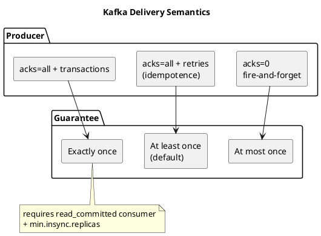

# Summary: Message Delivery Guarantees for Apache Kafka

**Source:** `raw/010. Message Delivery Guarantees for Apache Kafka.md`
**Source URL:** https://docs.confluent.io/kafka/design/delivery-semantics.html
**Date Ingested:** 2026-07-09

## Key Takeaways
- Kafka offers three **delivery semantics (семантики доставки)**, trading latency for durability:
  - **At most once (максимум один раз):** may lose messages, never duplicates.
  - **At least once (минимум один раз):** never loses, may duplicate — the **default**.
  - **Exactly once (строго один раз):** never lost, never duplicated.
- A message is **committed (закоммичено)** once written to the log and safe as long as one in-sync replica stays alive.
- **Producer side:** `acks=0` → at-most-once; retries → at-least-once; **idempotence (идемпотентность)** (since 0.11, PID + sequence number) removes duplicates; **transactions (транзакции)** enable exactly-once.
- **Consumer side:** commit-before-process → at-most-once; process-before-commit → at-least-once; transactional read-process-write with `isolation.level=read_committed` → exactly-once.
- **Exactly-once (EOS)** is built into Kafka Streams and Kafka Connect (atomic offset + data storage).

### Best Practices
- Correct mapping: at-least-once = `acks=all` (NOT `acks=1`); `acks=1` can silently drop data if the leader dies before replication.
- Exactly-once needs the full quartet: `acks=all` + `enable.idempotence=true` + transactional producer (`transactional.id`) + consumer `isolation.level=read_committed`.
- `min.insync.replicas` only takes effect with `acks=all`; with RF=3 and `min.insync.replicas=2` the leader rejects writes (`NotEnoughReplicasException`) if it can't reach the minimum ISR.

### Case Studies
- **Banking transfer via transactions:** debit + credit event + offset commit in one transaction; a crash rolls everything back, avoiding lost/duplicated money.
- **Retailer "network storm":** without idempotence, lost acks caused retried order batches to be written 2–3×, inflating sales; enabling `enable.idempotence=true` fixed it.
- **Auto-commit data loss:** default `enable.auto.commit=true` committed mid-batch; a pod crash skipped unprocessed payments. Fix: `enable.auto.commit=false` + `commitSync()` after gateway confirmation.
- **Transactional Outbox vs. 2PC:** storing Kafka `offset` in the same MySQL ACID transaction as the business write (then `consumer.seek()` on restart) eliminated duplicates without slow two-phase commit.

### Production-Ready Recommendations
- Disable auto-commit; commit manually (`commitSync`) at the end of each `poll()` batch.
- Make sinks idempotent: deterministic keys, SQL `INSERT ... ON CONFLICT DO UPDATE` (upsert), or use the message business-ID as document `_id` in Mongo/Elasticsearch.
- For critical data (finance/orders) always use `acks=all` + idempotence + transactions; for telemetry, `acks=0` is acceptable.

### Diagrams

## Concepts Covered
- [Delivery Semantics](../concepts/Delivery_Semantics.md)
- [Offsets](../concepts/Offsets.md)
- [Replication](../concepts/Replication.md)
- [Producers](../concepts/Producers.md)

