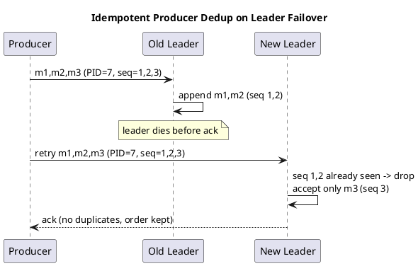

# Summary: Configuring Kafka Durability, Availability, and Ordering Guarantees

**Source:** `raw/011. Configuring Apache Kafka® Durability, Availability, and Ordering Guarantees.md`
**Source URL:** https://www.youtube.com/watch?v=B8glj1BJkSw (Jun Rao, Confluent)
**Date Ingested:** 2026-07-09

## Key Takeaways
- **Replication (репликация)** provides durability/availability: N replicas tolerate N−1 failures; only committed data is exposed to consumers.
- **Producer acks (подтверждения):** `acks=0` (fire-and-forget, lowest latency, no durability), `acks=1` (leader log only, some loss risk on leader election), `acks=all` (all in-sync replicas, strongest — ~2.5× the latency of leader-only).
- **`min.insync.replicas` (минимум синхронных реплик):** rejects writes with a "not enough replicas" error if fewer than the configured ISR are available.
- **Ordering guarantees (гарантии порядка):** messages from one producer to a partition are stored and delivered in send order — but failures + retries can cause duplicates and reordering.
- **Idempotent producer (идемпотентный продюсер):** `enable.idempotence=true` tags records with a **Producer ID (PID)** + **sequence number (порядковый номер)**; the broker dedups and preserves order across leader failures.
- **End-to-end key ordering:** idempotence + `acks=all` + a single producer with keyed messages guarantees per-key order from producer to consumer.

### Best Practices
- For mission-critical topics, combine `acks=all` + `enable.idempotence=true` + `min.insync.replicas=2` (with RF=3).
- Keep `max.in.flight.requests.per.connection` ≤ 5 so idempotence preserves ordering.

### Production-Ready Recommendations
- Budget ~2.5× leader latency for `acks=all`; it is the price of durability.
- Handle `NotEnoughReplicasException` gracefully on the client (buffer/pause) rather than dropping data.

### Diagrams

## Concepts Covered
- [Replication](../concepts/Replication.md)
- [Delivery Semantics](../concepts/Delivery_Semantics.md)
- [Producers](../concepts/Producers.md)
- [In-Sync Replicas (ISR)](../concepts/ISR.md)

