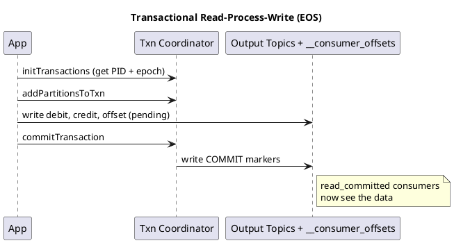

# Summary: Kafka Transactions — Message Delivery and Exactly-Once Semantics

**Source:** `raw/012. Apache Kafka® Transactions Message Delivery and Exactly-Once Semantics.md`
**Source URL:** https://www.youtube.com/watch?v=Ki2D2o9aVl8 (Jun Rao, Confluent)
**Date Ingested:** 2026-07-09

## Key Takeaways
- **Transactions (транзакции)** give database-style all-or-nothing atomic writes across multiple partitions/topics, plus the input offset commit — enabling **Exactly-Once Semantics (EOS, строго один раз)**.
- Enable via Kafka Streams `processing.guarantee=exactly_once(_v2)`; readers set `isolation.level=read_committed` to see only committed data.
- **Transaction coordinator (координатор транзакций):** a broker component (leader of a partition in the internal transaction-state topic) issues a **Producer ID + epoch (эпоха)** and records participating partitions.
- On restart, the coordinator **aborts pending transactions** from the old instance and **bumps the epoch** to fence off zombie producers.
- **Consuming committed data:** the broker tracks the **Last Stable Offset (LSO)** — the first open pending transaction — and returns metadata so consumers skip aborted records.
- Exactly-once automatically enables **idempotence (идемпотентность)** (PID + sequence number) to remove duplicates/reordering.

### Best Practices
- Balance the commit interval (default 100 ms): too frequent = coordinator overhead per partition; too large = delayed visibility downstream.
- Prefer `exactly_once_v2` for reduced overhead in modern versions.

### Case Studies
- **Fund transfer (Alice→Bob):** debit + credit + input-offset commit in one transaction; a mid-processing crash rolls back so Alice is not debited twice.

### Production-Ready Recommendations
- Kafka has **no two-phase commit** to external systems — for DB sinks, make the transactional Kafka output idempotent and apply it to the external system separately.
- Use `read_committed` on downstream consumers to avoid reading aborted/pending data.

### Diagrams

## Concepts Covered
- [Transactions](../concepts/Transactions.md)
- [Delivery Semantics](../concepts/Delivery_Semantics.md)
- [Offsets](../concepts/Offsets.md)

