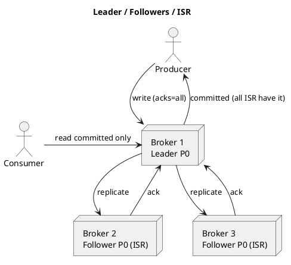

# Summary: Kafka Replication and Committed Messages

**Source:** `raw/013. Kafka Replication.md`
**Source URL:** https://docs.confluent.io/kafka/design/replication.html
**Date Ingested:** 2026-07-09

## Key Takeaways
- The unit of replication is the **partition (партиция)**; replication factor includes the leader (RF=1 means no replication). All reads/writes go through the **leader (лидер)**; **followers (фолловеры)** pull like consumers.
- **In-Sync Replicas (ISR, синхронные реплики):** a follower is "in sync" if it keeps its session and doesn't fall behind more than `replica.lag.time.max.ms`. A message is **committed (закоммичено)** only when all ISR have it; consumers see only committed messages.
- **Quorum model:** unlike majority vote (needs `2f+1` replicas for `f` failures), Kafka's ISR needs only `f+1` — commit latency bounded by the *slowest* ISR member, but far cheaper on disks.
- **No mandatory `fsync`:** Kafka relies on network replication + page cache; a crashed replica must fully re-sync before rejoining ISR.
- **Unclean leader election (грязные выборы лидера):** if all ISR die, choose between waiting for a consistent replica (default, `unclean.leader.election.enable=false`) vs. electing a stale replica (availability over consistency) — a CAP tradeoff.
- **Controller (контроллер):** one broker detects failures and batches leadership-change notifications for fast election at scale.

### Best Practices
- Standard: `replication.factor=3` + `min.insync.replicas=2` + producer `acks=all` + `enable.idempotence=true`.
- Use **Rack Awareness (`broker.rack`)** to spread replicas across racks/AZs; keep `auto.leader.rebalance.enable=true`.
- Never force `flush.messages`/`flush.ms` — trust replication + OS.

### Case Studies
- **Multi-AZ (Netflix/Uber):** ISR failover across availability zones survives a full AZ outage with only a brief latency blip.
- **Fintech zero-data-loss:** leader-only writes + ISR ensure a new leader always has committed payments.
- **IoT telemetry (availability):** `unclean.leader.election.enable=true` keeps real-time monitoring alive, accepting minor loss.

### Production-Ready Recommendations
- Keep `unclean.leader.election.enable=false` cluster-wide; override per-topic only with owner sign-off.
- Lower `replica.lag.time.max.ms` to 10–15 s to evict stuck brokers faster; tune `num.replica.fetchers` (2–4) for many partitions.
- Alert on `UnderReplicatedPartitions`, `OfflinePartitionsCount`, `ActiveControllerCount` (must equal 1).
- Migrate to **KRaft** to cut controller failover time and scale to millions of partitions.

### Diagrams

## Concepts Covered
- [Replication](../concepts/Replication.md)
- [In-Sync Replicas (ISR)](../concepts/ISR.md)
- [Controller](../concepts/Controller.md)
- [Delivery Semantics](../concepts/Delivery_Semantics.md)

