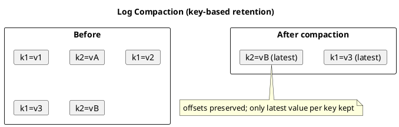

# Summary: Kafka Log Compaction

**Source:** `raw/014. Kafka Log Compaction.md`
**Source URL:** https://docs.confluent.io/kafka/design/log_compaction.html
**Date Ingested:** 2026-07-09

## Key Takeaways
- **Log compaction (сжатие лога)** retains the latest value per message **key (ключ)** while discarding older values — a full snapshot of the final state for every key.
- Contrast with time/size retention: compaction is **per-key retention (поkey-based удержание)**, ideal for restoring state, reloading caches, and event sourcing.
- **Tombstones (маркеры удаления):** a record with a key and **null payload** deletes that key; tombstones are themselves removed after `delete.retention.ms` (default 24h).
- The log has a **head** (dense sequential offsets, all messages) and a compacted **tail**; offsets never change and remain valid positions even if compacted away.
- Cleaning runs in the background by recopying segments, does not block reads, and can be I/O-throttled.

### Best Practices
- Compacted topics require keyed records; use consistent, meaningful keys (e.g. user ID).
- Protect fresh data with `min.compaction.lag.ms`; tune `min.cleanable.dirty.ratio` to balance CPU vs. disk.

### Case Studies
- **CDC (Debezium):** compacted topics hold current table state keyed by primary key.
- **Cache warm-up:** a restarting microservice replays a compacted topic to rebuild in-memory state fast.
- **Kafka Streams changelogs:** KTable state stores use compacted topics for fault-tolerant aggregations.

### Production-Ready Recommendations
- Set `delete.retention.ms` ≥ max consumer downtime so consumers don't miss tombstones.
- Scale `log.cleaner.threads` for many compacted partitions; use SSDs and I/O throttling.
- Alert on `uncleanable.partitions.count`, `max.clean.time.secs`, `max.compaction.delay.secs`.

### Diagrams

## Concepts Covered
- [Log Compaction](../concepts/Log_Compaction.md)
- [Topics](../concepts/Topics.md)
- [Offsets](../concepts/Offsets.md)

