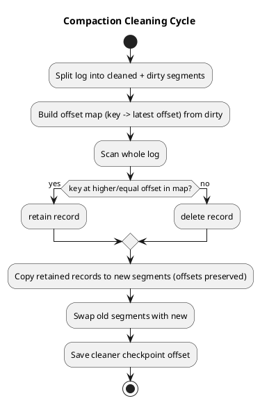

# Summary: Apache Kafka Topic Compaction (deep dive)

**Source:** `raw/015. Apache Kafka® Topic Compaction.md`
**Source URL:** https://www.youtube.com/watch?v=VAkhYxu1qII (Jun Rao, Confluent)
**Date Ingested:** 2026-07-09

## Key Takeaways
- Two retention modes: **time-based (по времени)** (`cleanup.policy=delete`) and **key-based compaction (по ключу)** (`cleanup.policy=compact`).
- Compaction keeps the latest record per key and bounds total storage, letting an app **bootstrap state** by reading from offset 0, then continue with incremental changes — one topic instead of two systems.
- **Compaction process:** split log into **cleaned** (no duplicates) and **dirty** segments → build an in-memory **offset map (key → latest offset)** → scan and retain only latest per key → copy survivors to new segments (preserving offsets, leaving gaps) → swap segments → save cleaner checkpoint.
- **Two-round tombstone/transaction-marker cleaning:** remove the record first but retain the tombstone/marker for a configured time so lagging consumers still observe the delete.
- **Trigger:** compaction fires when the dirty ratio exceeds a threshold (default ~50%); tune with `min.compaction.lag.ms` / `max.compaction.lag.ms`.

### Best Practices
- Use compaction for updatable, keyed state (customer profiles, product catalogs, ksqlDB tables, Streams state stores).
- Set a minimum compaction lag if consumers must observe intermediate updates.

### Production-Ready Recommendations
- Guarantee: you always see the *latest* value per key, but **not necessarily every update** — design accordingly.
- Keep compaction background I/O throttled so it doesn't impact producers/consumers.

### Diagrams

## Concepts Covered
- [Log Compaction](../concepts/Log_Compaction.md)
- [Kafka Streams](../concepts/Kafka_Streams.md)

