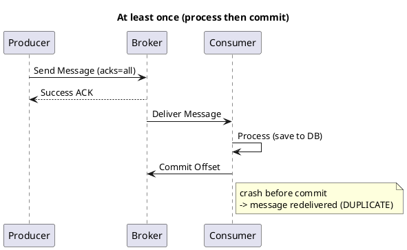
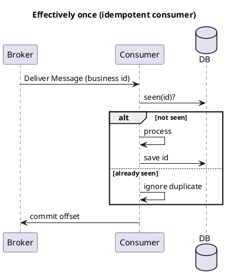

# Summary: Message Delivery Semantics (with Java examples)

**Source:** `raw/Message delivery semantics.md` (RU)
**Date Ingested:** 2026-07-09

## Key Takeaways
- Three classic **delivery semantics (семантики доставки)**: **At most once (максимум один раз)**, **At least once (минимум один раз)**, **Exactly once (ровно один раз)**.
- A practical fourth pattern: **Effectively once (эффективно один раз)** — run at-least-once but make the consumer **idempotent (идемпотентный)** by tracking processed message IDs and ignoring duplicates.
- **At most once:** producer `acks=0`, consumer commits offset *before* processing → possible loss, no duplicates.
- **At least once (default):** producer `acks=all` + retries, consumer processes *then* commits → no loss, possible duplicates.
- **Exactly once:** idempotent + transactional producer (`transactional.id`), consumer `isolation.level=read_committed`.
- **Poison Pills (ядовитые сообщения):** malformed messages can block a partition; route to a **Dead Letter Queue (DLQ/DLT)** after several failed attempts.

### Best Practices
- Default to At-least-once + idempotent consumer (Effectively once); reserve strict Exactly-once for critical pipelines (it's costly/slow).
- Keep `enable.idempotence=true` (default since Kafka 3.0) — a "free" reliability bonus.
- Always configure a DLQ/DLT to prevent blocked consumers.

### Case Studies
- **Metrics/IoT telemetry:** At-most-once acceptable (losing a few of 10,000/s is harmless).
- **E-commerce orders / emails:** At-least-once preferred (better a duplicate than a lost order).
- **Money transfer / billing:** Exactly-once required.

### Production-Ready Recommendations
- Effectively-once sink: check a `processed_messages_ids` table (or upsert by business key) inside a DB transaction before processing.
- Spring Kafka: use `ack-mode=MANUAL_IMMEDIATE` + `acknowledgment.acknowledge()` for at-least-once; check ID uniqueness with `@Transactional` for effectively-once.

### Diagrams

## Concepts Covered
- [Delivery Semantics](../concepts/Delivery_Semantics.md)
- [Dead Letter Queue](../concepts/Dead_Letter_Queue.md)
- [Transactions](../concepts/Transactions.md)

