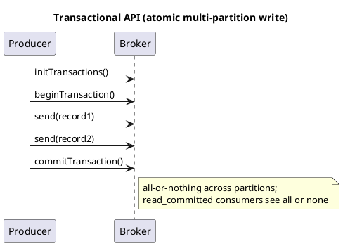

# Summary: Exactly-Once Semantics in Apache Kafka (Confluent/Badoo)

**Source:** `raw/Семантика exactly-once в Apache Kafka.md` (RU, Habr — translation of N. Narkhede)
**Source URL:** https://habr.com/ru/companies/badoo/articles/333046/
**Date Ingested:** 2026-07-09

## Key Takeaways
- **Exactly-once (строго однократная доставка)** arrived in Apache Kafka **0.11** via three related features: idempotence, transactions, and Streams EOS.
- Failures that force the problem: **broker failure (сбой брокера)**, **producer↔broker RPC failure (сбой RPC)** (ack lost after a successful write → retry → duplicate), and **client failure (сбой клиента)** (must distinguish permanent vs. transient; fence "zombie" producers).
- **Idempotence (идемпотентность):** `enable.idempotence=true` — like TCP but the **sequence number (порядковый номер)** is persisted to the replicated log, so any new leader also dedups. Low overhead (a few extra numeric fields).
- **Transactions (транзакции):** atomic writes across multiple partitions + committing consumer offset in the same transaction → end-to-end EOS. Consumer `isolation.level`: `read_committed` vs. `read_uncommitted`.
- **Streams EOS:** `processing.guarantee=exactly_once` makes read-process-write and recreated state exactly-once — the strongest guarantee among stream processors.
- Requires cooperation between the messaging system and the application; it is an end-to-end guarantee, not "magic dust" (except in the closed Streams world).

### Best Practices
- Use `read_committed` consumers and a unique `transactional.id` per app instance.
- For non-deterministic operations, exactly-once means output belongs to the set of valid outputs — design accordingly.

### Production-Ready Recommendations
- Performance impact is small: transactional producer ~3% below in-order at-least-once; idempotence negligible.
- The improved 0.11 message format made small-message throughput up to ~20% (producer) / ~50% (consumer) faster — a benefit even without using EOS.
- Tune the Streams commit interval: short (100 ms) trades throughput (15–30%) for low latency; large (30 s) removes overhead for ≥1 KB messages.

### Diagrams

## Concepts Covered
- [Transactions](../concepts/Transactions.md)
- [Delivery Semantics](../concepts/Delivery_Semantics.md)
- [Kafka Streams](../concepts/Kafka_Streams.md)

