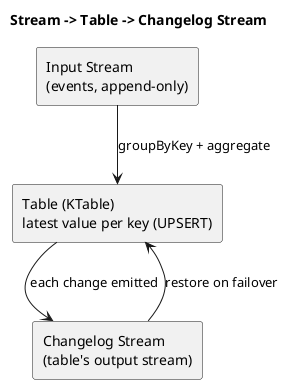

# Summary: Of Streams and Tables in Kafka and Stream Processing (Part 1)

**Source:** `raw/О стримах и таблицах в Kafka и Stream Processing, часть 1.md` (RU, Habr — translation of Michael G. Noll)
**Source URL:** https://habr.com/ru/companies/skbkontur/articles/353204/
**Date Ingested:** 2026-07-09

## Key Takeaways
- **Stream (стрим/поток):** the full history of all events (past + present) — continuously appended.
- **Table (таблица):** the current state of the world (present) — an aggregation of all events, continuously updated (UPSERT by key).
- With the full event history (stream) you can reconstruct the table state at any time `t`.
- **Topic (топик):** unbounded sequence of `<byte[], byte[]>` key-value pairs. **Stream = topic + schema** (`KStream`/`STREAM`). **Table = aggregated stream** (`KTable`/`TABLE`).
- **Aggregations (агрегации)** in Kafka are always computed per key (require `groupBy`/`groupByKey`), update continuously, and always return a table.
- **Stream–table duality (двойственность стрим-таблица):** a table has an internal **changelog stream (стрим изменений)** (like DB CDC); tables can become streams and vice versa. Changelogs are compacted Kafka topics providing elasticity/fault-tolerance and enabling state migration between machines.
- Databases think table-first; Kafka thinks stream-first ("turning the database inside-out"), making Kafka **stream-relational**.

### Best Practices
- Use tables for stateful processing (joins/data enrichment, aggregations); avoid stitching Kafka to remote stores (Cassandra/MySQL) + Hadoop when Streams/KSQL suffice.
- Prefer Avro + a Schema Registry to balance schema-on-read vs. schema-on-write.

### Case Studies
- **WordCount:** aggregating a stream of lines into a continuously-updated word-count table.
- **New York Times:** stores 160+ years of articles in Kafka as the source of truth.
- **Geolocation:** aggregate a `<User, GeoLocation>` stream into a table of latest location, or a `<User, Long>` table counting visited places.

### Production-Ready Recommendations
- KTable state stores are restored from their changelog topics on failover — treat changelogs as critical state backups.
- Remember aggregations are per-key *per-partition*; account for custom partitioners in processing logic.

### Diagrams

## Concepts Covered
- [Streams and Tables](../concepts/Streams_and_Tables.md)
- [Kafka Streams](../concepts/Kafka_Streams.md)
- [Log Compaction](../concepts/Log_Compaction.md)

