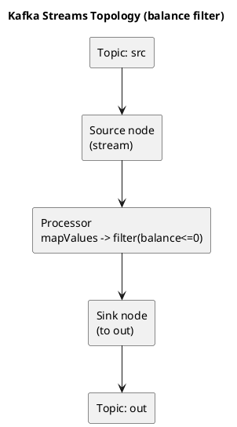

# Summary: Spring Boot Application Using Kafka Streams

**Source:** `raw/Spring Boot приложение с использованием Kafka Streams.md` (RU, Habr — МегаФон)
**Source URL:** https://habr.com/ru/companies/megafon/articles/504422/
**Date Ingested:** 2026-07-09

## Key Takeaways
- **Kafka Streams API** is a client library for real-time processing of data in Kafka, combining plain Java/Scala app simplicity with Kafka's server-side clustering.
- A Streams app is a **processing topology (топология обработки)** graph: source node (subscribe/read a topic) → processor node (business logic) → sink node (write to a topic).
- Example use case (МегаФон): read balance-change events `{phone_number, balance}` from topic `src`, filter `balance <= 0` in real time, write to topic `out`.
- Built with Spring Boot using `@EnableKafkaStreams`, a `KafkaStreamsConfiguration` bean (application id, bootstrap servers, default Serdes), custom `Serde<User>`, and a `KStream` bean applying `mapValues(...).filter(...).to("out")`.

### Best Practices
- Define explicit Serdes (`Consumed.with`, `Produced.with`) and a typed model (`User`) instead of relying on defaults.
- Keep the topology small and single-purpose (read → transform/filter → write).

### Production-Ready Recommendations
- Kafka Streams is a lightweight library embeddable in any Java app, with no external dependencies beyond Kafka.
- It supports fault-tolerant local state, **exactly-once processing** (each record processed once even on failure), and per-record millisecond-latency processing.

### Diagrams

## Concepts Covered
- [Kafka Streams](../concepts/Kafka_Streams.md)
- [Streams and Tables](../concepts/Streams_and_Tables.md)
- [Topics](../concepts/Topics.md)

