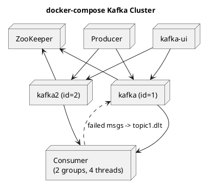

# Summary: Kafka in Practice — Standing Up a Kafka Cluster with docker-compose

**Source:** `raw/Работа Apache Kafka на примерах. Поднимаем Kafka Cluster используя docker-compose.md` (RU, Habr)
**Source URL:** https://habr.com/ru/articles/738874/
**Date Ingested:** 2026-07-09

## Key Takeaways
- Core terms recap: **Broker (брокер)**, **Producer (продюсер)**, **Consumer (консюмер)**, **ZooKeeper**, **Controller (контроллер)**, **Offset (офсет)**, **Partition (партиция)**, **Replica (реплика)**, **Topic (топик)**, **Consumer group (консюмер-группа)**.
- **Partition selection:** keyed messages → `hash(key) % partitions`; keyless → **Sticky Partitioner (round-robin batching)**.
- **Three scenarios** demonstrate consumer-group parallelism: one consumer reads per partition; a group gets all messages divided across its consumers; each group independently receives all messages; RF requires ≥ that many brokers.
- **Delivery semantics recap:** At most once / At least once / Exactly once (called out as expensive and risky — "don't strive for it" unless required).
- **Spring implementation:** producer via `KafkaTemplate` + JSON serializer; consumer with `ConcurrentKafkaListenerContainerFactory` (concurrency = 4 ≤ partitions), `ErrorHandlingDeserializer`, and a **Dead Letter Topic (DLT)** via `DeadLetterPublishingRecoverer` + `DefaultErrorHandler`.
- **Cluster via docker-compose:** ZooKeeper + 2 brokers (`KAFKA_OFFSETS_TOPIC_REPLICATION_FACTOR=2`) + Kafka UI (provectus) + producer/consumer services.

### Best Practices
- Threads must not be fewer than partitions and partitions not fewer than threads — one thread reads one partition; partition count can only be increased.
- DLT must have the same number of partitions as the source topic (the recoverer preserves the source partition).

### Case Studies
- Sending 10,000 messages: with 2 consumer groups each message is processed twice; messages where `number % 100 == 0` throw and are routed to the DLT (200 DLT messages = 10,000 / 100 × 2 groups).

### Production-Ready Recommendations
- Set RF=2+ only when broker count allows; use Kafka UI to inspect brokers, controller, partitions, and replica sync.
- Route failed (deserialization or business-logic) messages to a DLT instead of blocking the consumer.

### Diagrams

## Concepts Covered
- [Kafka Cluster & docker-compose](../concepts/Kafka_Cluster_Docker.md)
- [Dead Letter Queue](../concepts/Dead_Letter_Queue.md)
- [Consumer Groups](../concepts/Consumer_Groups.md)
- [Controller](../concepts/Controller.md)

