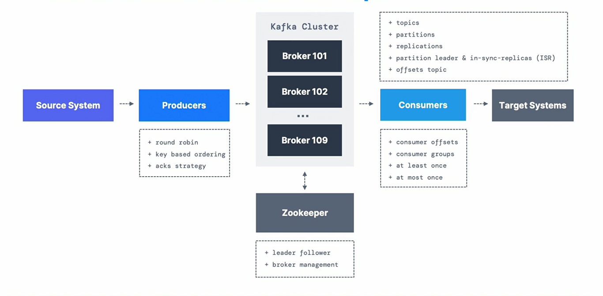

## Kafka cluster




## additional resources 
1. [How to Install Apache Kafka on Windows](https://learn.conduktor.io/kafka/how-to-install-apache-kafka-on-windows/#(optional)-Changing-the-Kafka-and-Zookeeper-data-storage-directory-5)
2. [How to Install Apache Kafka on Windows without Zookeeper (KRaft mode)](https://learn.conduktor.io/kafka/how-to-install-apache-kafka-on-windows-without-zookeeper-kraft-mode/)
3. [advanced-kafka-consumer-with-java](https://learn.conduktor.io/kafka/advanced-kafka-consumer-with-java/)
4 https://github.com/PacktPublishing/Apache-Kafka-Series---Learn-Apache-Kafka-for-Beginners-v3
4. https://github.com/Burakyvz/WikimediaStreamProcessor
5. https://github.com/sumankhara/Kafka
6. https://github.com/gustavo-flor/kafka-beginners-course

```shell
kafka-server-start.sh ~/kafka_2.13-3.9.0/config/kraft/server.properties
```


# Consumer 
## Strategies for committing offsets
1. At Least Once - No data loss - Reliable but may result in duplicates with no impedance 
* Pros: 
  * Ensures no message is lost.
  * Reliable for critical systems where data loss is unacceptable.
* Cons:
   * Messages may be processed more than once if the consumer crashes before committing offsets.
```java
props.put("enable.auto.commit", "false");
while (true) {
    ConsumerRecords<String, String> records = consumer.poll(Duration.ofMillis(100));
    for (ConsumerRecord<String, String> record : records) {
        // Process the record
        // Commit offsets after processing OR 
        consumer.commitSync();
    }
//    OR there
     consumer.commitSync();        
}
```
2. At Most Once - No duplicate processing - Fast but may lose messages.
* Pros:
  * Ensures no duplicate processing.
  * Useful for scenarios where duplicate processing is harmful or unacceptable.
* Cons:
  * Messages may be lost if the consumer crashes before processing them.
```java 
props.put("enable.auto.commit", "false"); // Disable auto-commit
while (true) {
    ConsumerRecords<String, String> records = consumer.poll(Duration.ofMillis(100));
    // Commit offsets before processing
    consumer.commitSync();

    for (ConsumerRecord<String, String> record : records) {
        // Process the record
    }
}
```
3. Exactly Once - No data loss - No duplicate processing Guarantees no duplicates or loss but requires more complexity. (streams and transactions)
* Pros:
  * Guarantees no data loss and no duplicate processing.
  * Ideal for critical systems requiring high reliability.
* Cons:
  * Requires careful implementation and configuration (e.g., enabling transactions).
  * May introduce additional overhead and complexity.
```java 
props.put("enable.auto.commit", "false"); // Disable auto-commit
props.put("isolation.level", "read_committed"); // Ensure transactions are respected
while (true) {
    ConsumerRecords<String, String> records = consumer.poll(Duration.ofMillis(100));
    Map<TopicPartition, OffsetAndMetadata> offsetsToCommit = new HashMap<>();

    for (ConsumerRecord<String, String> record : records) {
        // Process the record
        // Track offsets to commit
        offsetsToCommit.put(new TopicPartition(record.topic(), record.partition()),
                new OffsetAndMetadata(record.offset() + 1));
    }
    // Commit offsets atomically
    consumer.commitSync(offsetsToCommit);
} 
```
4. Manual Offset Management - Provides full control but requires careful implementation.
```java
props.put("enable.auto.commit", "false"); // Disable auto-commit

while (true) {
    ConsumerRecords<String, String> records = consumer.poll(Duration.ofMillis(100));
    for (ConsumerRecord<String, String> record : records) {
        // Process the record
    }

    // Commit offsets manually commitSync() or commitAsync().
    consumer.commitAsync((offsets, exception) -> {});
}
```
5. Automatic Offset Management - Simplicity - Simple but less reliable in case of crashes.
* Pros:
  * Easy to implement (minimal configuration).
  * Suitable for non-critical applications.
* Cons:
  * May lead to data loss or duplicate processing if the consumer crashes between automatic commits.
  * Less control over when offsets are committed.
```java 
props.put("enable.auto.commit", "true"); // Enable auto-commit
props.put("auto.commit.interval.ms", "1000"); // Commit offsets every second
```